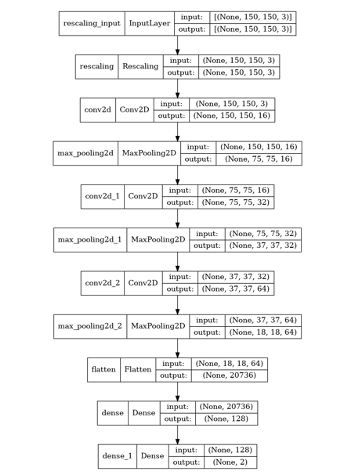

We chose to use a classic CNN sequential architecture to do our model 

### Structure of the model. 
The structure of the model is the following :

 *The structure of our CNN* 

The activation function are relu with a same padding. We use an Adam optimizer with categorical cross entropy loss function to optimize our weights.

### Performance of the model.

