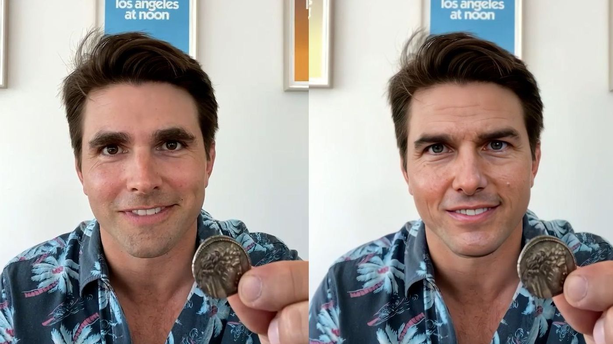

## Deepfake detection 

### Why detecting deepfake ?

Deep learning has successfully solved a variety of complex problems ranging from big data analysis to computer vision and human control, and has been. However, advances in deep learning are also being used to create software that could threaten privacy, democracy, and national security. One such application with deep learning is Deepfake, whose algorithms can create fake human-generated images and videos.

In this context, it is becoming increasingly hard to distinguish deepfake images from reality.

 *The Tiktok channel Deepfake Tom Cruise showcase a fake Tom Cruise using Deepfake techniques such as GANs* 

While some deep fakes can be created using conventional visual effects or computer graphics approaches, the general mechanism underlying the creation of deep fakes today is the use of deep fakes such as auto-encoders and GANs (Generative Adversarial Networks), which are based on Learning Models.

### Deepfake classification ?

In this context, we were provided with a dataset of c. 7k images classified with labels 1 if the image is a deepfake, 0 either. We chose to leverage CNN to deal with this image classification task.
